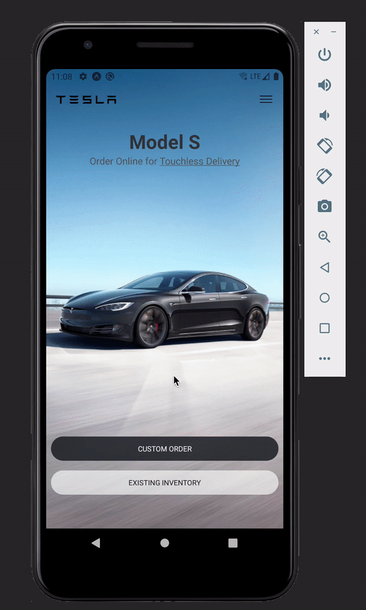

# Tesla-clone

A simple and quick clone app of the Tesla website with Expo client, basic layout with components like Flatlist, webview, buttons and Images. Nothing fancy at the moment.

Things I might include:

- ~React navigation, stack navigator~
- ~webview to load some CTA links~

Recently added (25.Jul.21)

- Added test cases for App screen(with stack navigator), Browser screen, Custom Button, Header component.
  Still need to include test cases for CarItem, CarList and HomeScreen

